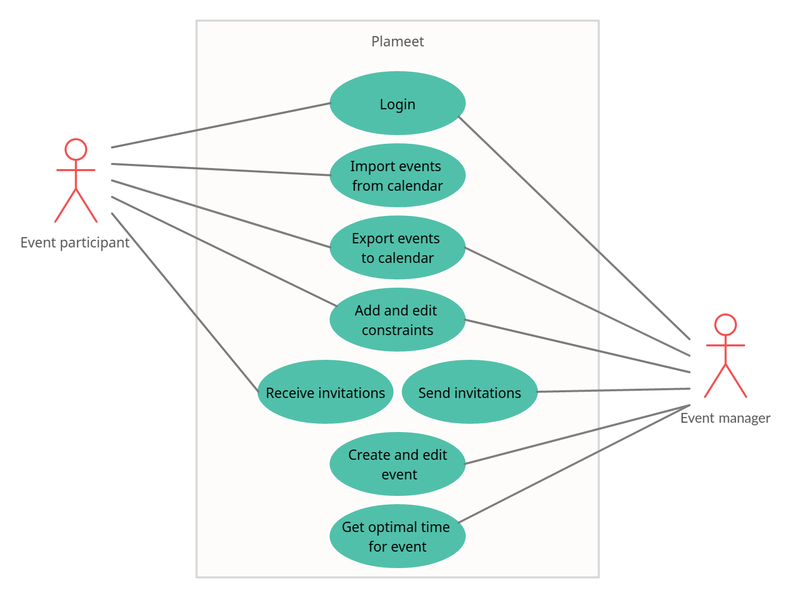

## User Roles

### Event manager

The event manager can sign in, create and edit event with conditions of its holding, send invitations to the participants,
get the optimal time for the event, export the event to a calendar

### Event participant 

Event participants can sign in, import theirs events from different calendars
(e.g. Google Calendar), add and edit constraints, receive invitations, and export events to a calendar

## User Case Diagram

  

## User Story

- As an event manager, I want to quickly collect information about the schedule of participants,
  so as not to interview everyone personally.

- As an event manager, I want to automatically receive the most suitable time for the event,
  so that I do not manually take into account the conditions from each of the event participants
  and reduce time spent on this process.

- As an event participant, I want to semi-automatically add my busy time from other calendars, so as
  not to manually transfer data from different calendars.

## Job Story

- When I organize an event, I want to get information when they can attend it, so I can reduce time spent on personal communication

- When I agree on a series of events, I want to automatically determine the optimal time, so I can reduce time spent on the thought process and minimize the risk of mistakes

- When I am invited to an event, I want to mark the time when I am busy semi-automatically and conveniently, so I can reduce time spent on non-intellectually clicking
